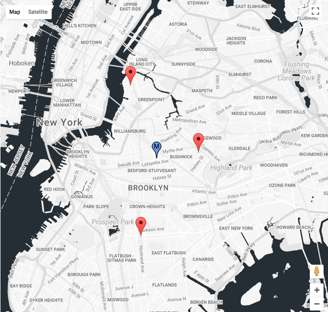
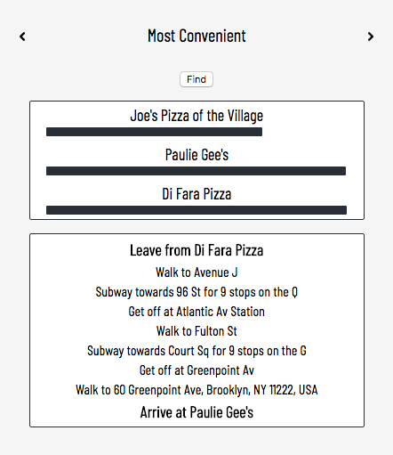

# Midpoint

[View Midpoint Live][live]

[live]: http://willjohnson.tech/Midpoint

Midpoint is a map tool for calculating convenient meeting locations between friends. It is written in React and implements Google Maps API.

Finding a place to hang out can be difficult. Meeting up with friends who are all an hour train ride away from each other is almost impossible. Midpoint makes it easy to decide where to gather by using location methods, transit preferences, and simple math to determine which location makes the most sense for a group of spread out friends.

## Features

All features in Midpoint are centered around the main map. Users can add several locations with tag names in the upper left hand corner and use the other features for calculating a number of interesting points of interest.

### Midpoint

The first feature of Midpoint is finding the exact geographical midpoint between several locations. By calculating the latitude and longitude of all entered locations, Midpoint calculates the mathematical average of both and reveals the exact center.

### Most Convenient

"Most Convenient" is for groups of friends looking to congregate at one of the friend's current location. This feature calculates the travel time for every possible trip (where origin and destination are two of the user added locations) and determines which of the locations should be the meeting place based on least total travel time. Users can look through all these calculated trips and view directions and total travel time.

## Upcoming Features

The following is a collection of features that are yet to be implemented, but will be soon.

### Transit Calculation

This (probably NYC specific) feature will factor in MTA travel time and return the Subway stop that is most quickly reached by all parties involved.

### Location Based Search

Once the user has a central location established by one of the other features, this feature will reveal all nearby establishments (bar, restaurant, etc) that fit the users criteria. Location based search will either be done with Google Maps API or I may decide to implement Yelp's.
